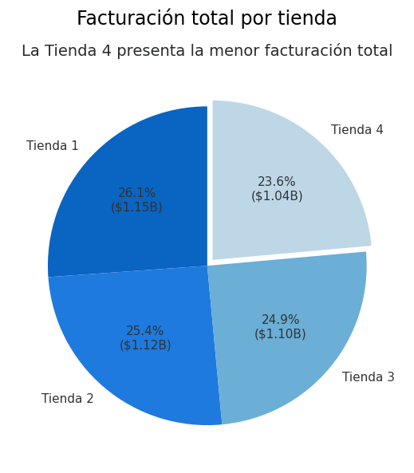
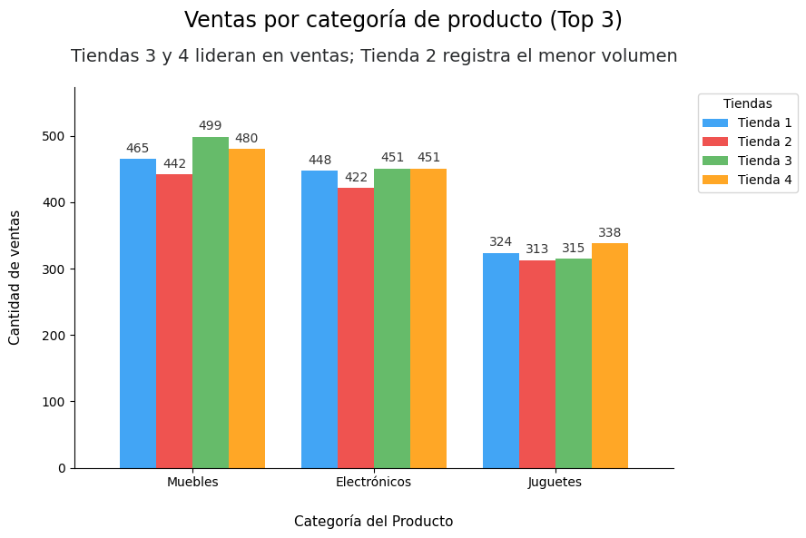
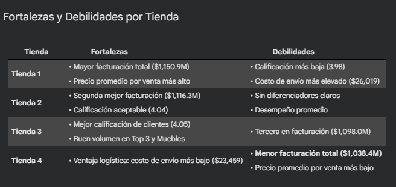

<h1 align="center">📊 Challenge Alura Store - Análisis de Datos</h1>

<p align="center">
  
  
  
  
  
  
</p>

<p align="center">
  🔗 <a href="https://github.com/Aiello-M/Challenge-AluraStore" target="_blank">Ver repositorio</a> | 
  <a href="https://colab.research.google.com/github/Aiello-M/Challenge-AluraStore/blob/main/Challenge_AluraStore.ipynb" target="_blank">Abrir Notebook en Colab</a>
</p>

---

## 📚 Sobre el Challenge

**Challenge**: Este desafío forma parte del curso de especialización en Data Science de [Alura Latam](https://www.aluracursos.com/)

**Programa**: Oracle Next Education (ONE) - G9 en colaboración con Alura Latam

**Formación**: Fundamentos de Python y Datos G9 - ONE


---

## 📝 Descripción General

El proyecto **Alura Store** tiene como objetivo analizar el desempeño de cuatro tiendas de una cadena comercial para proporcionar una recomendación basada en datos al Sr. Juan sobre **cuál sucursal debería vender** para optimizar su patrimonio e invertir en un nuevo emprendimiento.

### 🎯 Objetivo

Identificar la tienda con menor eficiencia operativa y financiera mediante el análisis de cinco ejes fundamentales:

1. **💰 Facturación total** de cada tienda
2. **📦 Categorías más populares** de productos
3. **⭐ Promedio de calificación** de los clientes
4. **🛍️ Productos más y menos vendidos**
5. **🚚 Costo promedio de envío** que pagan los clientes

---

## 🗂️ Estructura del Proyecto
```
Challenge-AluraStore-DataScience/
│
├── Challenge_AluraStore.ipynb       # Notebook principal con análisis completo
├── README.md                        # Documentación del proyecto
├── assets/                          # Imágenes para documentación
│   ├── imgPerfil.jpg
│   ├── img1.png                     # Gráfico de facturación
│   ├── img2.png                     # Gráfico de categorías
│   └── img3.png                     # Tabla resumen
│   ├── logo_alura.png               # logo de Alura 
└── datos/                           # Datasets de las 4 tiendas
    ├── tienda_1.csv
    ├── tienda_2.csv
    ├── tienda_3.csv
    └── tienda_4.csv
```

---

## 📷 Visualizaciones Destacadas

<table>
  <tr>
    <td align="center">
      <strong>📊 Distribución de Facturación</strong><br>
      
    </td>
    <td align="center">
      <strong>📦 Categorías Más Vendidas</strong><br>
      
    </td>
  </tr>
  <tr>
    <td align="center">
      <strong>⭐ Calificaciones por Tienda</strong><br>
      
    </td>
    <td align="center">
      <strong>📋 Resumen Ejecutivo</strong><br>
      
    </td>
  </tr>
</table>

---

## 🔍 Metodología del Análisis

### 1️⃣ **Exploración Inicial de Datos**
- Carga de 4 datasets (CSV) desde repositorio GitHub de Alura
- Verificación de estructura, tipos de datos y valores nulos
- Total: **9,435 transacciones** analizadas

### 2️⃣ **Análisis por Eje**
Cada uno de los 5 factores fue evaluado mediante:
- Funciones personalizadas para cálculos
- DataFrames de Pandas para organización de datos
- Visualizaciones con Matplotlib
- Observaciones basadas en datos

### 3️⃣ **Informe Final**
- Comparación de fortalezas y debilidades por tienda
- Recomendación fundamentada con evidencia cuantitativa
  

**Conclusión**: Vender la **Tienda 4**

---

## 📊 Resultados Clave

| Tienda | Facturación | Calificación | Costo Envío | Recomendación |
|:------:|:-----------:|:------------:|:-----------:|:-------------:|
| **Tienda 1** | \$1,150.9M (26.1%) | 3.98 ⭐ | \$26,019 | ✅ **Mantener** |
| **Tienda 2** | \$1,116.3M (25.4%) | 4.04 ⭐ | \$25,216 | ✅ **Mantener** |
| **Tienda 3** | \$1,098.0M (24.9%) | 4.05 ⭐ | \$24,806 | ✅ **Mantener** |
| **Tienda 4** | \$1,038.4M (23.6%) | 4.00 ⭐ | \$23,459 | ❌ **Vender** |

### 🎯 Justificación de la Recomendación

> **La Tienda 4 genera \$112.5 millones menos que la Tienda 1** a pesar de procesar el mismo volumen de transacciones (2,359 ventas). Su precio promedio por venta (\$440,363) es el más bajo de la cadena, lo que indica que está enfocada en productos de menor valor. Aunque tiene una ventaja en costos de envío, esta eficiencia logística no compensó su déficit en facturación.

---

## 🛠️ Tecnologías Utilizadas

- **Google Colab** – Entorno de desarrollo en la nube
- **Python 3.8+** – Lenguaje de programación
- **Pandas** – Manipulación y análisis de datos
- **Matplotlib** – Visualización de datos (gráficos de torta, barras, subplots)
- **NumPy** – Operaciones numéricas

---

## 🚀 Cómo Ejecutar el Proyecto

### Opción 1: Google Colab (Recomendado)
1. Abre el [notebook en Colab](LINK_A_TU_COLAB)
2. Click en **"Copiar en Drive"**
3. Ejecuta todas las celdas: `Runtime` → `Run all`

### Opción 2: Jupyter Notebook Local
```bash
# Clonar repositorio
git clone https://github.com/TU_USUARIO/Challenge-AluraStore-DataScience.git

# Instalar dependencias
pip install pandas matplotlib numpy

# Abrir notebook
jupyter notebook Desafio_AluraStore.ipynb
```

---

## 📂 Fuente de Datos

Los datasets fueron proporcionados por Alura Latam y están disponibles en:
- [tienda_1.csv](https://raw.githubusercontent.com/alura-es-cursos/challenge1-data-science-latam/refs/heads/main/base-de-datos-challenge1-latam/tienda_1%20.csv)
- [tienda_2.csv](https://raw.githubusercontent.com/alura-es-cursos/challenge1-data-science-latam/refs/heads/main/base-de-datos-challenge1-latam/tienda_2.csv)
- [tienda_3.csv](https://raw.githubusercontent.com/alura-es-cursos/challenge1-data-science-latam/refs/heads/main/base-de-datos-challenge1-latam/tienda_3.csv)
- [tienda_4.csv](https://raw.githubusercontent.com/alura-es-cursos/challenge1-data-science-latam/refs/heads/main/base-de-datos-challenge1-latam/tienda_4.csv)

---

## ✒️ Autora

| [<br><sub>Mariana Aiello</sub>](https://github.com/Aiello-M) |
| :---: |

---

## 📝 Licencia

Este proyecto es de código abierto y está disponible bajo la licencia MIT.

---

<p align="center">
  Desarrollado con 💙 como parte del programa Oracle Next Education (ONE) - G9
</p>
